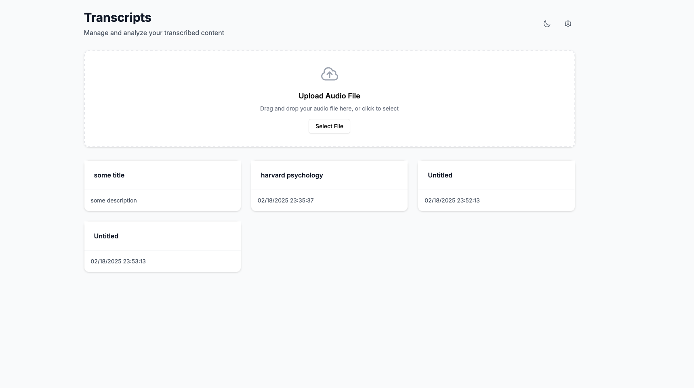
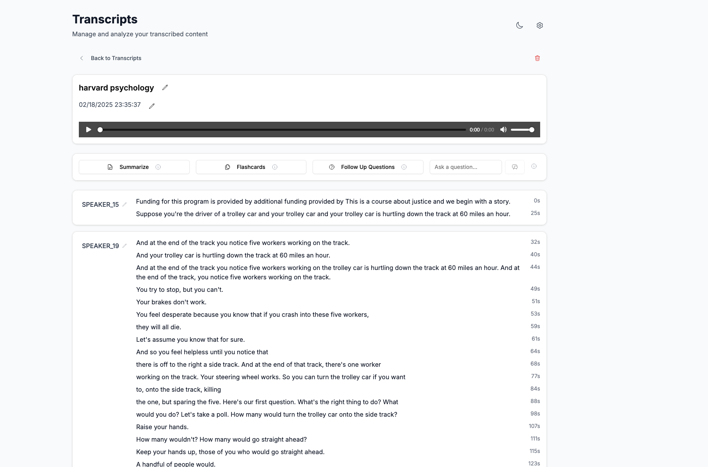
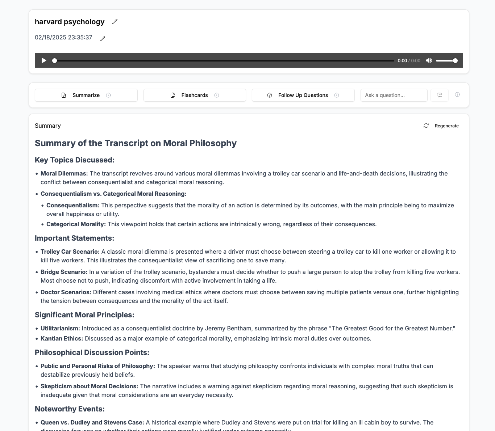
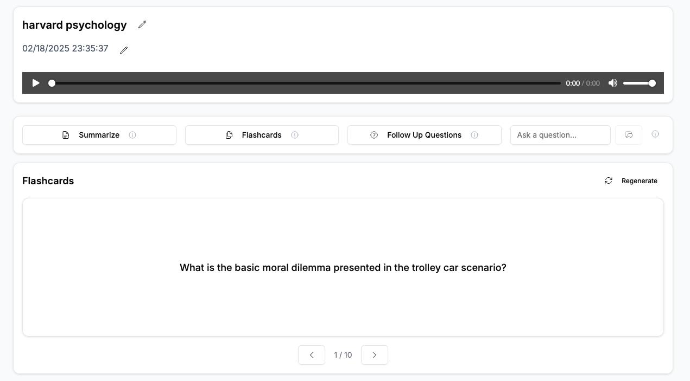
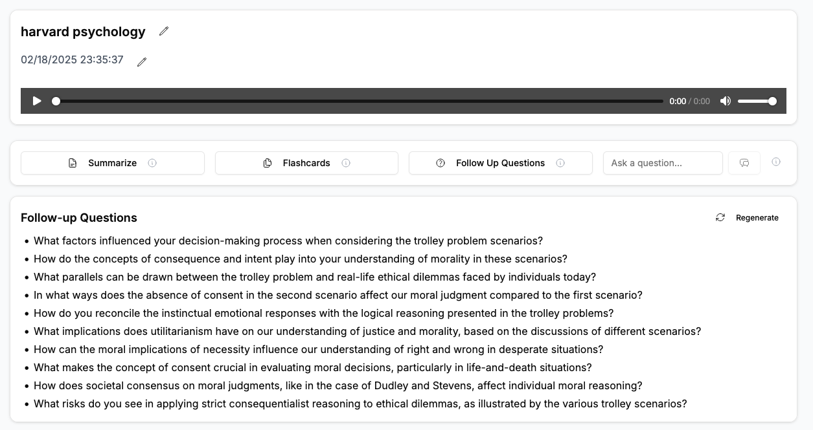
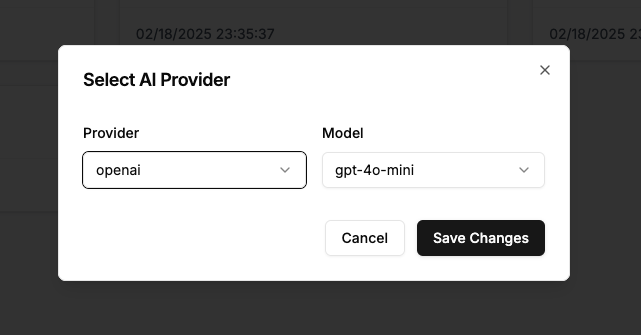

# Applaud

> Applaud is free, private, and open source audio transcription and summarization tool. It's designed to take audio recordings and provide a transcription, as well as common AI use-cases like flashcards, questions, and summaries.

The goal is to provide a self-hosted alternative to [https://www.plaud.ai/](Plaud). Some people don't like the idea of uploading their audio recordings to a third-party service. With Applaud, you can host it yourself and keep your data private. Applaud even supports local LLM models using [Ollama](https://ollama.ai/).

NOTE: This is not intended to be hosted on a public server. It is designed to be run locally on your own machine. There is no _authentication_ or _authorization_ built into the application. 

## Features

- Automatically syncs audio recordings (e.g. iCloud Drive, Google Drive, etc.)
- Transcribes audio recordings into a JSON file using `insanely-fast-whisper` with full CUDA and MPS (Apple Silicon) support
- Summarizes the transcript using the models of your choice
- Generates flashcards, questions, and answers from the transcript

## Supported LLM Providers

✅ OpenAI (`.env` `OPENAI_API_KEY`)

✅ Anthropic (`.env` `ANTHROPIC_API_KEY`)

✅ Google (`.env` `GOOGLE_API_KEY`)

✅ Ollama (`.env` `OLLAMA_BASE_URL` and `OLLAMA_API_KEY`)

✅ OpenRouter (`.env` `OPENROUTER_API_KEY`)

Once the frontend and backend are deployed, visiting http://localhost:3000 for the first time will prompt you to set up your LLM provider. You can change models at any time by selecting the cog icon in the top right corner.
If you wish to use Ollama, there are a few additional steps to take. 

### Ollama Setup

1. Install `ollama` and start the server: `ollama serve`
2. [Create a 120k context window model](https://github.com/ollama/ollama/issues/5965#issuecomment-2252354726)
    - `ollama install llama3.2`
    - `ollama show --modelfile llama3.2 > Modelfile`
    - Set `PARAMETER num_ctx 120000`
    - `ollama create -f Modelfile llama3.2-120k`
3. Configure the `.env` `OLLAMA_BASE_URL` to point to your Ollama instance (typically `http://localhost:11434/v1` unless you're hosting it on an external server)
4. Configure the `.env` `OLLAMA_API_KEY` to your Ollama API key (usually doesn't matter, but if you have secured your Ollama instance, you may need to set this)
5. Visit the frontend and choose `ollama` as the provider and `llama3.2-120k` as the model

## Requirements

This has been tested on macOS. Linux support should be supported. Windows support is not guaranteed.

- `docker compose`
- `python@3.11`
- `ffmpeg`

## Setup

1. Clone the repository: `git clone https://github.com/landoncrabtree/applaud.git && cd applaud`
2. Prepare the environment variables: `cp .env.example .env`
3. Refer to the `watcher/README.md` for instructions on how to setup and start the watcher service
4. Modify `.env` with any API keys for different LLM providers
5. Start the frontend and backend services: `docker compose up`
    - The frontend will be available at `http://localhost:3000`
    - The backend will be available at `http://localhost:8080`

## Screenshots

## Benchmarks

Using `insanely-fast-whisper` with `distil-whisper/large-v2` and `pyannote/speaker-diarization-3.1` on a M2 Max MacBook Pro (32GB RAM, 30 GPU Cores)

| Audio Duration | File Size | Transcription Time | Segmentation Time (speaker diarization) |
|----------------|-----------|--------------------|-------------------------------------------|
| 54:56          | 67.6MB    | 09:48               | 02:36                                     |

## TODO

- [ ] Fix watcher sometimes duplicating files
- [ ] UI/UX improvements
- [ ] Add more AI tools
- [ ] Chat side panel with conversation history per transcript
- [ ] Change all hardcoded references to `localhost:8080` to be dynamic
- [ ] Fix delete foreign key constraint (just delete all references first, then delete the transcript)
